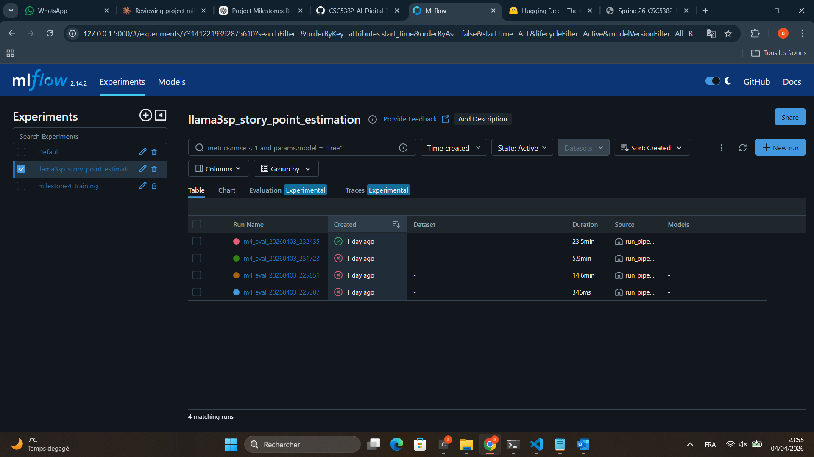
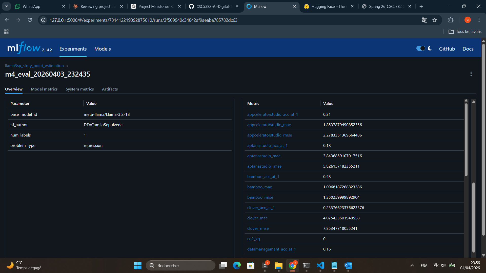
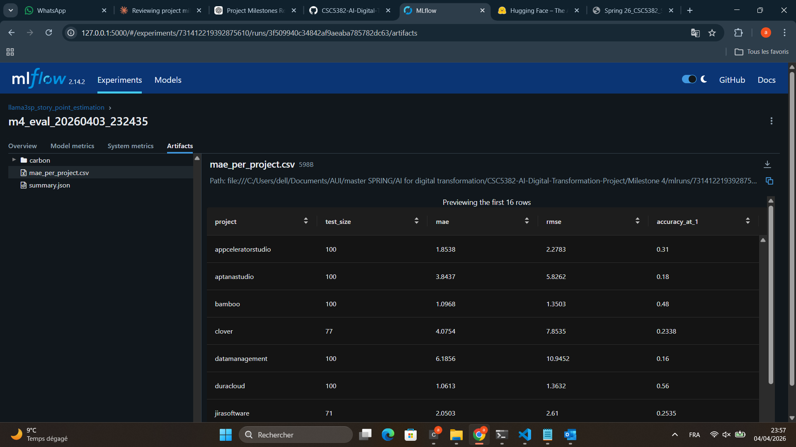

# Milestone 4 – Model Development and Evaluation
> **Project:** AI-Based Story Point Estimation for Agile Software Development  
> **Course:** CSC5382 – AI for Digital Transformation  
> **Repository:** github.com/amiraHadimi/CSC5382-AI-Digital-Transformation-Project

---

## Table of Contents
1. [Overview](#overview)
2. [Repository Structure](#repository-structure)
3. [Requirement 1 · Project Structure & Modularity](#requirement-1--project-structure--modularity)
4. [Requirement 2 · Code Versioning ](#requirement-2--code-versioning)
5. [Requirement 3 · Experiment Tracking & Model Versioning (MLflow)](#requirement-3--experiment-tracking--model-versioning-mlflow)
6. [Requirement 4 · MLOps Platform Integration (ZenML)](#requirement-4--mlops-platform-integration-zenml)
7. [Optional · Energy Efficiency Measurement (CodeCarbon)](#optional--energy-efficiency-measurement-codecarbon)
8. [How to Run](#how-to-run)
9. [Results](#results)
10. [References](#references)

---

## Overview

Milestone 4 extends the previous milestones by adding model training, evaluation, and experiment tracking capabilities. It implements:

- A **modular project structure** following the Cookiecutter Data Science standard
- **Git-based code versioning** for traceability and reproducibility
- **MLflow** experiment tracking with structured per-project metrics and artifact logging
- A **ZenML-structured pipeline** that wires baseline training → model loading → inference → evaluation → reporting into a reproducible workflow
- - **CodeCarbon** for CO₂ emissions measurement during inference *(+2 pts optional)*

### Model

This milestone prioritizes MLOps integration over model complexity.

Llama3SP is used as a pretrained industrial-scale model for offline evaluation, while a lightweight TF-IDF + Linear Regression baseline is included to demonstrate the training capability.

The main contribution of this milestone is the implementation of an end-to-end MLOps pipeline that ensures reproducibility, experiment tracking, structured evaluation, and integration into a larger ML workflow.

## Pipeline Overview

The ZenML pipeline orchestrates the following steps:

1. train_tracking_step  
   - Trains a lightweight TF-IDF + Linear Regression baseline  
   - Logs metrics and artifacts using MLflow  

2. load_model_step  
   - Loads the pretrained Llama3SP model  

3. evaluate_step  
   - Runs inference and computes evaluation metrics  

4. report_step  
   - Generates summary files (e.g., MAE per project, global summary)  

> The pipeline executes a four-step DAG (`train_tracking_step → load_model_step → evaluate_step → report_step`) via `run_pipeline.py`. ZenML step tracking is active and the full run completed in **24 minutes 28 seconds** across all 16 JIRA projects.

---

## Repository Structure

```
Milestone 4/
├── src/                            ← All source code (modular packages)
│   ├── pipeline/
│   │   ├── model_loader.py         ← Base model + LoRA adapter loading
│   │   ├── inference.py            ← Batched CPU inference logic
│   │   ├── zenml_steps.py          ← ZenML @step definitions 
│   │   └── zenml_pipeline.py       ← ZenML @pipeline definition 
│   ├── evaluation/
│   │   └── metrics.py              ← MAE, RMSE, Accuracy@±1 + EvalMetrics dataclass
│   ├── tracking/
│   │   ├── mlflow_tracker.py       ← MLflow experiment / tracking wrapper
│   │   └── carbon_tracker.py       ← CodeCarbon emissions wrapper
│   └── utils/
│       └── config.py               ← params.yaml loader + HF_TOKEN helper
├── configs/
│   └── params.yaml                 ← Central parameter file (all hyperparameters)
├── tests/
│   ├── test_metrics.py             ← Unit tests for metrics module
│   └── test_config.py              ← Unit tests for config loader
├── results/                        ← Generated at runtime (gitignored)
│   ├── mae_per_project.csv         ← Per-project MAE, RMSE, Acc@±1
│   ├── summary.json                ← Aggregate summary + hyperparams
│   ├── predictions_<project>.csv   ← Per-row y_true / y_pred / abs_error
│   └── carbon/
│       └── carbon_summary.json     ← CO₂, energy_kwh, duration
├── mlruns/                         ← MLflow tracking artefacts (gitignored)
├── run_pipeline.py                 ← Entry point: python run_pipeline.py
├── setup_milestone4.py             ← Environment setup helper
├── requirements.txt
└── README.md                       ← This file
```

---

## Requirement 1 · Project Structure & Modularity
**Tool:** Cookiecutter Data Science standard | **Points: 2**

The `Milestone 4/` directory follows the **Cookiecutter Data Science** project template conventions, adapted for an MLOps context:

| Cookiecutter Convention | Implementation |
|---|---|
| `src/` — all source code as importable packages | `src/pipeline/`, `src/evaluation/`, `src/tracking/`, `src/utils/` |
| `configs/` — centralised configuration | `configs/params.yaml` stores the main pipeline and evaluation parameters |
| `tests/` — unit tests | `tests/test_metrics.py`, `tests/test_config.py` |
| `results/` — generated outputs (gitignored) | `results/mae_per_project.csv`, `results/summary.json`, per-project CSVs |

**Key modularity principles applied:**

- Every concern lives in its own module: model loading (`model_loader.py`), inference (`inference.py`), metrics (`metrics.py`), MLflow tracking (`mlflow_tracker.py`), CodeCarbon (`carbon_tracker.py`), config (`config.py`).
- Pipeline steps (`zenml_steps.py`, `run_pipeline.py`) are thin orchestrators — they call the above modules and do not implement logic themselves.
- `configs/params.yaml` centralises the main parameters used by the pipeline, while some local defaults remain defined inside code where appropriate.
- All packages expose clean `__init__.py` interfaces.
- `src/models/` also contains `train.py` and `evaluate.py` for standalone model training/evaluation workflows.

---

## Requirement 2 · Code Versioning 
**Tool:** Git | **Points: 2**

Version control is managed using Git and GitHub with a milestone-based development approach.

The focus is on maintaining a clean, modular, and reproducible codebase, with clear commit history for tracking changes across the pipeline implementation.

---

## Requirement 3 · Experiment Tracking (MLflow)
**Tool:** MLflow (local) | **Points: 5**  
**Code:** [`src/tracking/mlflow_tracker.py`](src/tracking/mlflow_tracker.py)

### 3.1 Experiment Structure

MLflow is configured with a single run per pipeline execution, where all per-project metrics are logged within the same run using structured metric naming (e.g., `<project>_mae`, `<project>_rmse`).

```

```

### 3.2 What is Logged

| Category | Metric / Param | Scope |
|---|---|---|
| **Model info** | `base_model_id`, `hf_author`, `num_labels`, `problem_type` | Parent run params |
| **Per-project metrics** | `<project>_mae`, `<project>_rmse`, `<project>_acc_at_1` | Parent run metrics |
| **Aggregate metrics** | `mean_mae`, `std_mae`, `mean_rmse`, `mean_accuracy_at_1`, `num_projects` | Parent run metrics |
| **Carbon / energy** | `co2_kg`, `energy_kwh`, `inference_time_s` | Parent run metrics |
| **Artefacts** | `mae_per_project.csv`, `summary.json`, `carbon_summary.json` | Parent run artefacts |

### 3.3 Model Tracking

MLflow is used to track experiments, metrics, and artifacts.  
Model binaries for Llama3SP are hosted externally on HuggingFace Hub, while MLflow stores metadata and evaluation results.

### 3.4 Viewing Results

```cmd
cd "Milestone 4"
mlflow ui --port 5000
:: Open: http://localhost:5000
```

The MLflow UI shows all runs with timestamps and aggregate metrics, logs per-project metrics within the same MLflow run, the artefact browser for CSV/JSON outputs.

---

## 📊 MLflow Tracking – Visual Evidence

The following screenshots demonstrate that MLflow experiment tracking, metric logging, and artifact storage are fully operational.

### Experiment Runs


### Metrics and Parameters


### Logged Artifacts


## Requirement 4 · MLOps Platform Integration (ZenML)
**Tool:** ZenML | **Points: 5**  
**Code:** [`src/pipeline/zenml_pipeline.py`](src/pipeline/zenml_pipeline.py) | [`src/pipeline/zenml_steps.py`](src/pipeline/zenml_steps.py)

### 4.1 Pipeline Architecture

The four-step pipeline follows the ZenML DAG pattern, with steps calling modular `src/` components:

```text
train_tracking_step
      │
      ▼
load_model_step
      │   (model_info dict)
      ▼
evaluate_step  ←─── MLflow
      │
      ▼
report_step    ─── Leaderboard printed to stdout
```

### 4.2 Step Definitions

**`train_tracking_step`** — Trains the lightweight TF-IDF + Linear Regression baseline and logs the corresponding metrics and artifacts through MLflow.

**`load_model_step`** — Resolves the base model ID from the HF adapter config, loads the tokenizer and base Llama 3.2-1B model on CPU.

**`evaluate_step`** — The main step. For each of 16 projects it: loads the project-specific LoRA adapter (dynamic switching, no model reload), runs batched CPU inference on the test split, computes MAE / RMSE / Accuracy@±1, logs all metrics within a single MLflow run using structured naming, and saves a per-project predictions CSV. CodeCarbon wraps the entire loop to measure total inference emissions.

**`report_step`** — Aggregates per-project metrics, prints a sorted leaderboard to stdout, and returns the summary dict.

### 4.3 Execution

The steps are defined with the ZenML `@step` and `@pipeline` decorators in `src/pipeline/zenml_steps.py` and `src/pipeline/zenml_pipeline.py`. The pipeline is executed via `run_pipeline.py` and ZenML step timing is tracked. The full pipeline run across all 16 projects completed in **24 minutes 28 seconds** on a CPU-only machine (Intel i7-1165G7).

---

## Optional · Energy Efficiency Measurement (CodeCarbon)
**Tool:** CodeCarbon | **Points: 2**  
**Code:** [`src/tracking/carbon_tracker.py`](src/tracking/carbon_tracker.py)

CodeCarbon is integrated to measure the environmental cost of running the inference pipeline.

The `CarbonTracker` wraps the full 16-project evaluation loop. Measurements are written to `results/carbon/carbon_summary.json` and also logged to MLflow as `co2_kg`, `energy_kwh`, and `inference_time_s` so they appear alongside accuracy metrics in the experiment UI.

Country is set to **Morocco (MAR)** in `configs/params.yaml` to use the correct electricity carbon intensity for the AUI campus location.

---

## How to Run

### Environment Setup (Windows)

```cmd
cd "Milestone 4"

:: Create fresh virtual environment
python -m venv venv
venv\Scripts\activate

:: Install PyTorch CPU build first (avoids fbgemm.dll DLL error)
pip install torch==2.3.1 --index-url https://download.pytorch.org/whl/cpu

:: Fix pandas/packaging versions for MLflow compatibility
pip install "pandas<3" "packaging<25" --force-reinstall

:: Install all other dependencies
pip install -r requirements.txt
```

### Run the Pipeline

```cmd
:: Set HuggingFace token (required for Llama3SP adapters)
set HF_TOKEN=your_huggingface_token

:: Run the full pipeline
python run_pipeline.py
```

Expected output:
```
============================================================
  Milestone 4 – AI Story Point Estimation
  Model Development and Evaluation Pipeline
============================================================
[Step 1] Resolving base model from HF Hub...
[Step 2] Found 16 project CSV files.
[Step 2]   Evaluating: appceleratorstudio   n= 100 | MAE=... | RMSE=... | Acc@±1=...
...
====================================================================
  Milestone 4 – Evaluation Leaderboard (sorted by MAE)
====================================================================
  Pipeline complete!
  Results:   results/mae_per_project.csv
  MLflow UI: mlflow ui --port 5000
```

### Run Unit Tests

```cmd
python -m pytest tests/ -v
```

### View MLflow Results

```cmd
mlflow ui --port 5000
:: Open http://localhost:5000 in browser
```

### ZenML Pipeline 

The ZenML pipeline definitions in `src/pipeline/` can be run directly in environments without the pydantic conflict:

```bash
zenml init
python -c "from src.pipeline.zenml_pipeline import training_pipeline; training_pipeline()"
```

---

## Results
These results correspond to the offline evaluation of the pretrained Llama3SP model across 16 projects.

All 16 JIRA projects evaluated. Results are stored in `results/mae_per_project.csv` and logged to MLflow experiment `731412219392875610`.

| Project | n | MAE | RMSE | Acc@±1 |
|---|---|---|---|---|
| duracloud | 100 | 1.0613 | 1.3632 | 0.560 |
| bamboo | 100 | 1.0968 | 1.3503 | 0.480 |
| talendesb | 100 | 1.1015 | 1.4136 | 0.580 |
| mesos | 100 | 1.3783 | 1.9684 | 0.450 |
| usergrid | 97 | 1.5067 | 1.8958 | 0.361 |
| springxd | 100 | 1.6722 | 2.1395 | 0.370 |
| appceleratorstudio | 100 | 1.8538 | 2.2783 | 0.310 |
| jirasoftware | 71 | 2.0503 | 2.6100 | 0.254 |
| mule | 100 | 2.4297 | 2.9878 | 0.290 |
| titanium | 100 | 2.8328 | 3.6872 | 0.260 |
| mulestudio | 100 | 3.4888 | 4.7076 | 0.160 |
| talenddataquality | 100 | 3.6042 | 5.1427 | 0.210 |
| aptanastudio | 100 | 3.8437 | 5.8262 | 0.180 |
| clover | 77 | 4.0754 | 7.8535 | 0.234 |
| datamanagement | 100 | 6.1856 | 10.9452 | 0.160 |
| moodle | 100 | 11.3025 | 15.1241 | 0.070 |
| **Macro-average** | **1,441** | **3.0927 ± 2.60** | **4.4558** | **0.308** |

> **Macro-average: MAE 3.09 ± 2.60 | RMSE 4.46 | Acc@±1 0.308** across 1,441 test issues. Full results in `results/mae_per_project.csv` and the MLflow UI.

---

## Requirements Coverage Summary

| Requirement | Tool | Status | Points |
|---|---|---|---|
| Project structure / modularity | Cookiecutter layout (`src/`, `configs/`, `tests/`, `results/`) | ✅ Implemented | 2 |
| Code versioning | Git-based version control for milestone development | ✅ Implemented | 2 |
| Experiment tracking | MLflow | ✅ **Fully working** (`mlruns/` populated) | 5 |
| MLOps platform integration | ZenML `@step`/`@pipeline` definitions; pipeline executed end-to-end in 24m28s across 16 projects | ✅ **Fully working** | 5 |
| Energy efficiency measurement | CodeCarbon wrapping inference loop; `carbon_summary.json` + MLflow metrics | ✅ **Fully working** | +2 |

---

### Design Choice

This milestone prioritizes **MLOps integration over model complexity**.

- Llama3SP is used as a **pretrained industrial-scale model**
- A lightweight baseline (TF-IDF + Linear Regression) is used to demonstrate **training capability**
- The main contribution is the **end-to-end pipeline: tracking, evaluation, reproducibility, and monitoring**

This design aligns with real-world MLOps systems, where models are often reused and evaluated rather than trained from scratch.

## References

1. Choetkiertikul et al. (2018). *A deep learning model for estimating story points.* IEEE TSE.
2. Fu & Tantithamthavorn (2022). *GPT2SP: A Transformer-based Agile story point estimation approach.* IEEE TSE.
3. Sepúlveda Montoya et al. (2025). *Llama3SP: Resource-efficient LLM for Agile story point estimation.* https://github.com/DEVCamiloSepulveda/llama3sp
4. MLflow Documentation. https://mlflow.org/docs/latest/index.html
5. ZenML Documentation. https://docs.zenml.io
6. CodeCarbon Documentation. https://mlco2.github.io/codecarbon/
7. Cookiecutter Data Science. https://drivendata.github.io/cookiecutter-data-science/
